# Spider

> 由于学校网络中心出问题了，第一个项目原来的域名暂时访问不了，然后自己新开了一个URL：[https://jinshuai86.github.io/EtrizDoc](https://jinshuai86.github.io/EtrizDoc)

[](http://hits.dwyl.io/jinshuai86/Spider)

Spider是一个基于Java的简易多线程爬虫框架，并且提供了默认组件。用户也可以根据需要实现自己的组件  
- 具体流程
  - 首先在调度器中添加初始种子，开启线程池。
  - 工作线程开始从种子调度器中取URL种子
  - 使用下载器获取URL对应的页面内容
  - 使用解析器解析页面内容，将页面里的URL封装成URL种子，添加到种子调度器中。
  - 持久器会判断是否已经存在类似的文本内容，如果存在会做丢弃处理，否则会将页面中的内容做持久化处理。
  


# 使用说明

## 开发环境
- JDK8+
- Maven3+
- lombok

## 使用
- 修改`application.properties`中存放解析内容的路径`dir`
- 如果使用`Redis`作为种子调度器(默认使用优先队列)，需要修改`application.properties`中配置的`ip`、`port`和`password`。如果你的Redis不需要密码验证，就不用修改文件里的`password`属性。
- 默认解析器解析的[河北工业大学新闻网](http://xww.hebut.edu.cn/gdyw/index.htm)中的新闻，如果解析其它类型的网页，需要重写`Parser.java`接口以及提供给种子调度器的初始种子
- 运行`Spider.java`
```Java
        Spider.build()
                .addUrlSeed(new UrlSeed("http://xww.hebut.edu.cn/gdyw/index.htm"))
                .run();
```

# 项目结构

```Shell
├── logs                                          // 系统日志
├── spider-consumer                               // 消费模块(消费4XX 3XX状态码对应URL)
├── spider-core                                   // 爬虫模块
│   ├── src                                       // 源码
│   ├── |——main
│   ├── ├──|——java/com/jinshuai                          
│   ├── ├──├──|——core                             // 核心组件
│   ├── ├──├──|————downloader                     // 下载器
│   ├── ├──├──|————parser                         // 解析器
│   ├── ├──├──|————saver                          // 持久器
│   ├── ├──├──|————scheduler                      // URL调度器
│   ├── ├──├──|——entity                           // 实体
│   ├── ├──├──|——util                             // 工具
│   ├── ├──|——resources                           // 资源目录
│   ├── ├──|——|——application.properties           // 配置文件

```

# 进度
## Finished
- [x] 配置了[Http连接池](https://hc.apache.org/httpcomponents-client-ga/)，完成了Http请求和处理Http响应<br>
- [x] [解析](https://jsoup.org/)响应的内容
- [x] 配置线程池，通过[Redis](https://redis.io/)缓存URL种子
- [x] 持久化解析结果
- [x] 添加新的种子调度器（优先队列结合布隆过滤器）
- [x] 对于Redis调度器，存放url对应的hash进行判重减少空间使用
- [x] 使用SimHash进行文本相似度检测
- [x] 将3XX 4XX 5XX状态码对应URL放到消息队列中去消费

## TODO
- [ ] 定时解析失败日志，将失败URL重新加入爬取仓库，设置失败次数限制，超过指定次数就放弃。
- [ ] 各个组件进行热替换
- [ ] 优化解析页面代码

# 参考
- **代码和设计思路**参考自[https://github.com/xjtushilei/ScriptSpider](https://github.com/xjtushilei/ScriptSpider)
